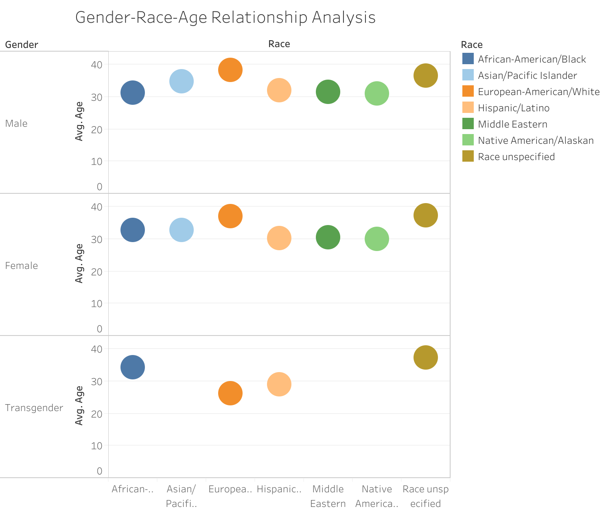
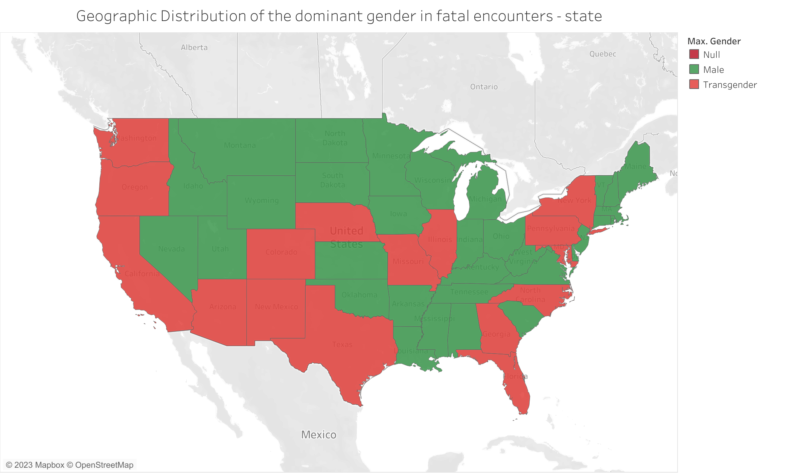
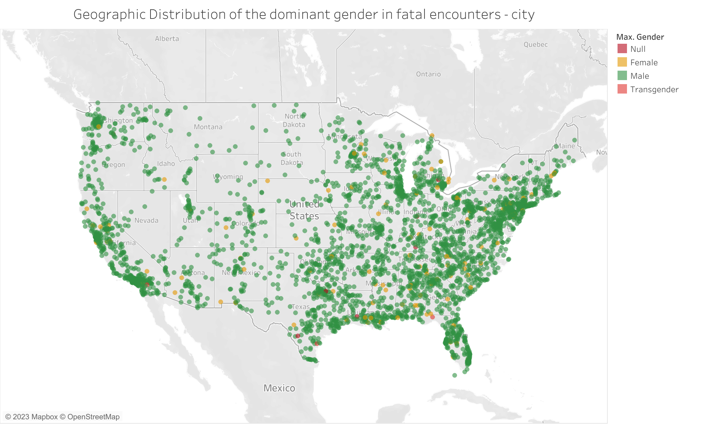
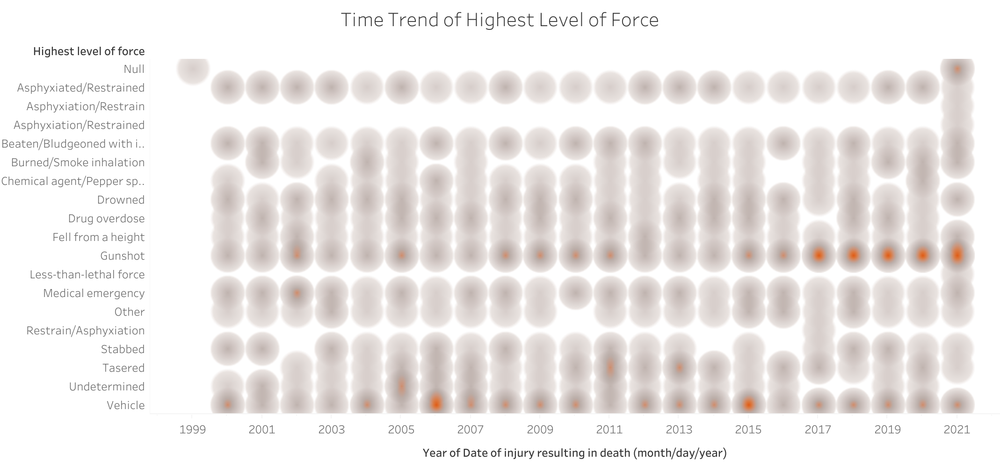

# fatal-encounter-viz

## Introduction
This is the first major homework assignment for the Urban Analytics course. For this assignment, I will visualize data on police killings of civilians and tell a story from a gender perspective.
https://github.com/me-shaon/GLWTPL/blob/master/LICENSE

## Method & Data
R
Tableau
Data: https://fatalencounters.org/
This project is [GLWTPL](https://github.com/me-shaon/GLWTPL/blob/master/LICENSE) except for the data.

## Tableau Visualization

## Insights

There is a significant gender disparity in police killings, with males accounting for nearly 90% of the total incidents. This suggests that males are disproportionately affected by police violence.

The age group most affected by police killings is 25-40, indicating that young adults are at a higher risk. This is a concerning trend that needs to be addressed.

There is a noticeable disparity in police violence across different age ranges and genders, with young adult females being particularly affected. This highlights the intersectionality of age, gender, and violence, and underscores the need for interventions that take these factors into account.

The number of police killings has been increasing over time, peaking in 2020. This upward trend is alarming and suggests that current measures to prevent police violence may be insufficient.

Among females, Asians and Whites are more likely to be victims of police killings compared to other races. This racial disparity points to the need for targeted interventions to protect these vulnerable groups.

These conclusions underscore the urgent need for comprehensive reforms and interventions to address police violence. It’s crucial that these efforts consider the intersecting factors of gender, age, and race to effectively reduce and prevent such incidents.